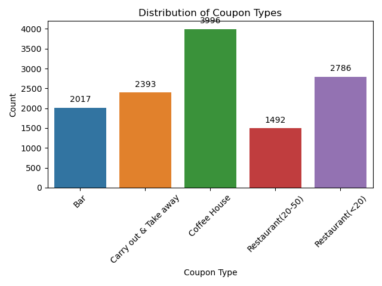
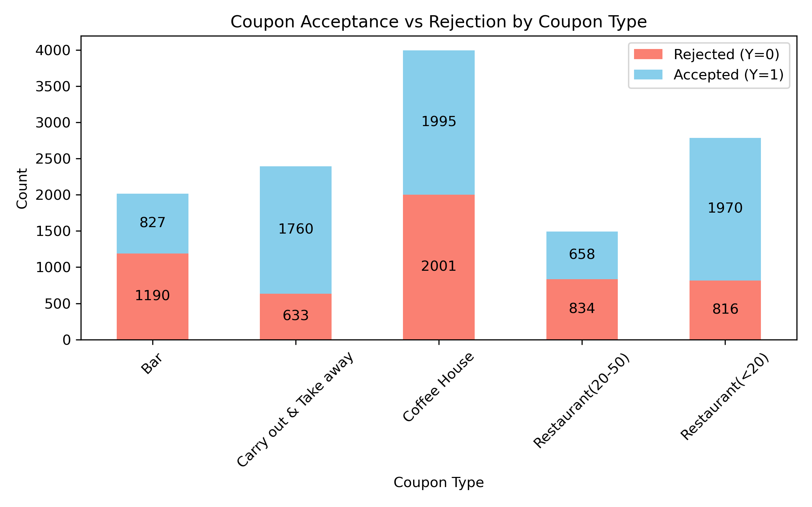
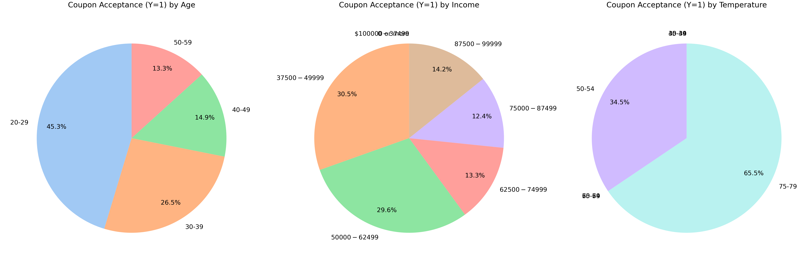
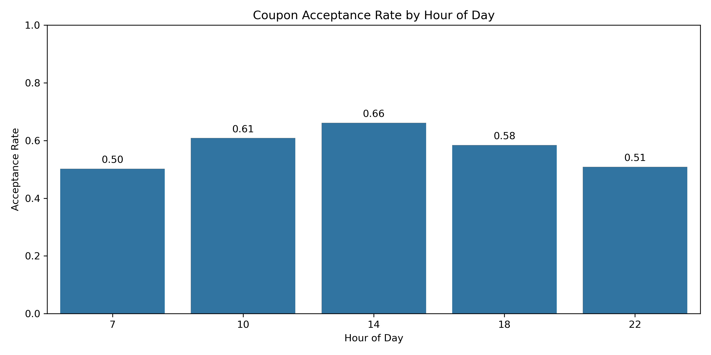
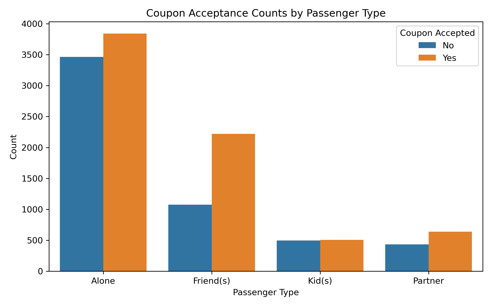
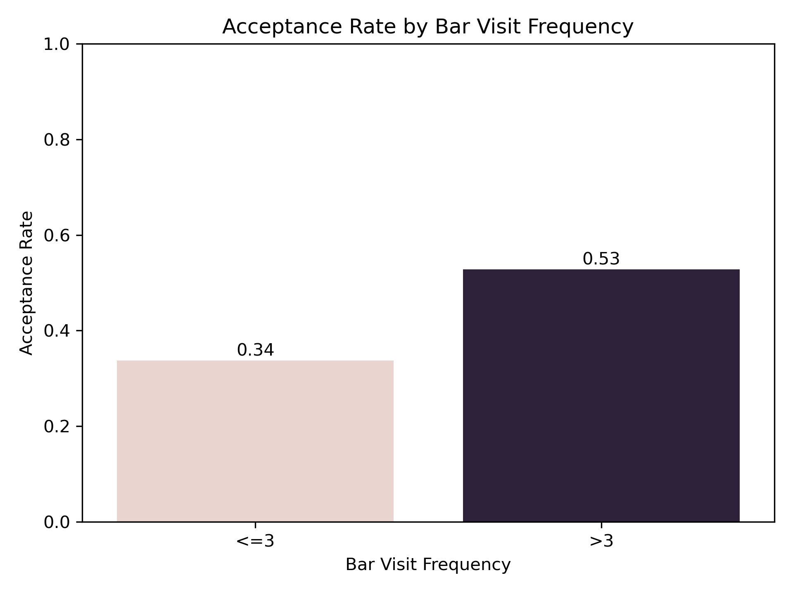
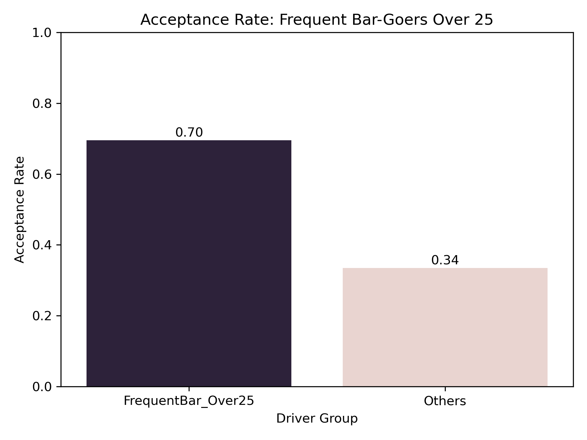
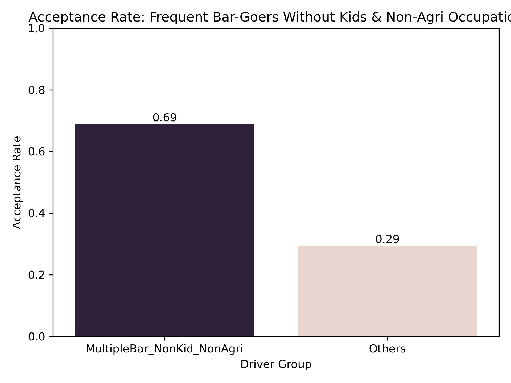
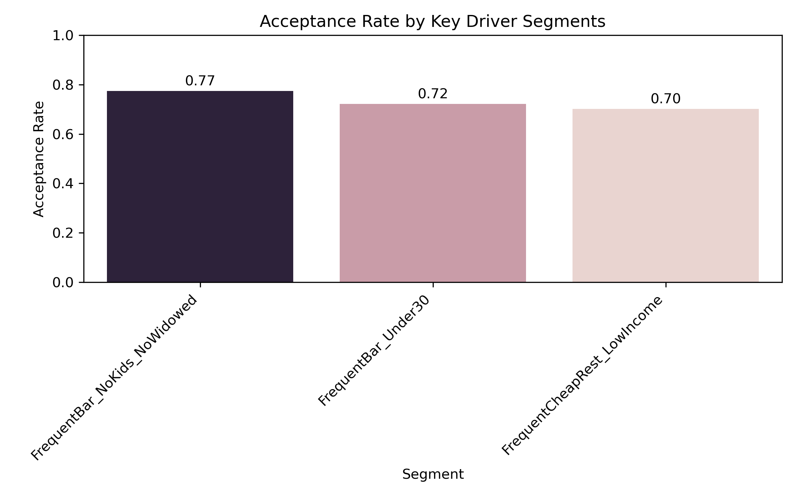
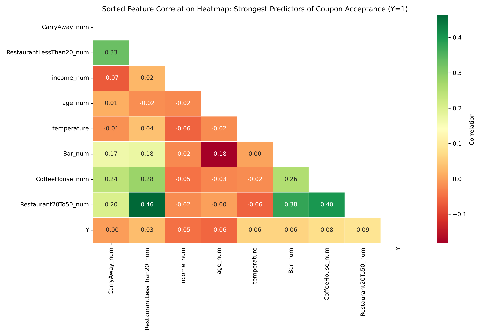

# Coupon Acceptance Analytics
**This project explores how drivers’ profile characteristics, such as age, income, passenger type, and marital status, influence their responses to different coupon types. Using data analysis and visualization techniques, we aim to uncover patterns and insights that can inform targeted promotional strategies.**

## Background / Motivation
This project uses the Coupon dataset (from a survey via Amazon Mechanical Turk, available through the UCI Machine Learning Repository) with a learning-focused approach to practice core data analytics skills. It provides an opportunity to explore, clean, and visualize data; examine behavioral patterns based on demographic and situational factors; calculate acceptance probabilities; segment driver groups; and derive actionable insights. The ultimate aim is to understand which drivers are most likely to accept coupons, helping marketers optimize promotional campaigns—all within a structured, hands-on learning context.

## Objective / Goal
- Explore patterns in driver behavior and decision-making related to coupon acceptance.
- Identify key factors—such as passenger type, age, income, destination, and visit frequency—that influence whether a coupon is accepted.
- Generate visual insights and data-driven hypotheses to support targeted marketing and promotional strategies.

## Dataset Description
- **Number of Observations:** ~12,680  
- **Key Features:**
  - `coupon` – Type of coupon delivered (e.g., Bar, Coffeehouse, Restaurant).  
  - `Bar`, `CoffeeHouse`, `RestaurantLessThan20`, `Restaurant20To50` – Frequency of visits to these establishments.  
  - `passanger`, `maritalStatus`, `age`, `income`, `weather`, `time` – Demographic and situational characteristics.  
  - `Y` – Target variable: 1 if the driver accepted the coupon, 0 otherwise.  
  - Detailed description of various data attributes is provided in the jupyter notebook.

## Data Cleaning / Preprocessing
- Converted categorical frequency values (e.g., `never`, `1~3`, `4~8`, `gt8`) to numeric counts.  
- Converted `age` and `income` to numeric types.  
- Filtered subsets for targeted analysis (e.g., bar coupons).  
- **Missing Values:** Present in below features and handled during preprocessing. For example, `car` is more likely to be dropped as it is missing in 99% times whereas it was more reasonable to impute the other columns with mode (or another meaningful value).
    ```
    Missing Data Report:
                        Missing Values  Percent Missing
    car                            12576        99.148534
    Bar                              107         0.843582
    CoffeeHouse                      217         1.710817
    CarryAway                        151         1.190476
    RestaurantLessThan20             130         1.024913
    Restaurant20To50                 189         1.490066
    ```

## Exploratory Data Analysis & Key Findings

The purpose of EDA is to **understand the data, discover patterns, and identify trends** before performing any predictive analysis. This project examines **driver behavior and coupon acceptance** across different coupon types, demographics, and situational factors and present the analyses and corresponding visualizations as follows:

**1. Coupon Distribution**  
   - Shows the frequency of each coupon type (e.g., Bar, Coffeehouse, Cheap/Expensive Restaurants) to help understand the dataset composition and which coupon types are more common.
   

**2. Acceptance by Coupon Types**  
   - Compares how likely drivers are to accept each coupon type.
   

**3. Coupon Acceptance by Age, Income, Temprature and Time**  
   - Visualize the distribution of age, income and temperature that reveals trends like the most likely age group, income range, or weather conditions during trips to accept the coupons.
    
   - Below graph depicts *Acceptance Rate by Time of Day*  
     (Convert `time` (e.g., 7AM, 2PM) to numeric hours and calculate acceptance rates for each hour)
    

**4. Passenger Influence**  
   Passenger presence significantly influences coupon acceptance. Drivers traveling with children show lower acceptance rates, while those driving alone or with adult passengers are more likely to accept coupons, suggesting situational constraints play a key role in decision-making.
   

**5. Sample Investigation to Find Correlations Between Features for Coupon Type 'Bar'**
    
Below graph depicts the acceptance rate between those who went to a bar 3 or fewer times a month to those who went more and they are less likely to accept bar coupons

        
Similarly, following graph depicts the acceptance rate between drivers who go to a bar more than once a month and are over the age of 25 to the all others. They are more likely to accept the coupons than the others.

        
As another example, below graph depicts the acceptance rate between drivers who go to bars more than once a month and had passengers that was not a kid and had occupations other than farming, fishing, or forestry. The plot shows that these drivers are **more likely to accept bar coupons**, highlighting the influence of both passenger type and occupation.


Furthermore, this graph depict comparison of the acceptance rates between those drivers that below to one of the following categories.
1. go to bars more than once a month, had passengers that were not a kid, and were not widowed
2. go to bars more than once a month and are under the age of 30 
3. go to cheap restaurants more than 4 times a month and income is less than 50K

The data shows there is similarity in the bar coupon acceptance behavior between these categories.

Drivers who frequently visit bars, are not accompanied by children, and are not widowed have the highest likelihood of accepting bar coupons (~77%). Younger drivers (under 30) who frequently go to bars also show a high acceptance rate (~73%). Drivers who are occasional bar-goers, accompanied by children, or widowed are less likely to accept bar coupons (~35-37%).

**Conclusion**: Frequency of bar visits, passenger type, age, and marital status are strong predictors of bar coupon acceptance.

> **Note:** For a similar analysis on another coupon type, please refer to the last section of [this Jupyter notebook](https://github.com/swarnima-shrivastava/coupon-acceptance-analytics/blob/main/prompt.ipynb).

**Overall correlation between numeric features and coupon acceptance (Y)** can be depicted using below heatmap.


## Predictive Insights / Hypotheses
Above insights help **identify patterns and trends**, such as which types of drivers or situations are most associated with coupon acceptance. They also form the basis for the **hypotheses** discussed in this section, for why some drivers accept coupons while others do not, setting the stage for further **predictive analysis**.

- Drivers whose **habits align with the coupon type**—for example, frequent bar-goers for bar coupons or regular visitors to cheap restaurants—are more likely to accept those coupons.  
- **Situational factors** such as passenger presence (especially children), marital status, and age significantly influence acceptance decisions. Drivers traveling alone or with adults, and younger drivers, tend to accept coupons more often.  
- Low-income drivers who **frequently visit cheap restaurants** show higher acceptance rates for restaurant coupons, whereas they are less likely to accept bar coupons.  
- Overall, **behavioral patterns combined with demographic characteristics** (visit frequency, age, income, passenger type, marital status) provide strong predictive signals for coupon acceptance.  
- These insights can inform **targeted marketing strategies**, allowing businesses to focus promotions on segments most likely to respond positively, maximizing the efficiency of coupon campaigns.

## Conclusion
This project analyzed driver behavior in response to different types of coupons, using a combination of exploratory data analysis and visualizations. Key factors such as **habitual behavior, passenger presence, age, income, and marital status** were found to influence coupon acceptance. Frequent bar-goers traveling without children and younger drivers were most likely to accept coupons, while occasional bar-goers or those with children showed lower acceptance rates. 

The insights derived from this analysis provide a foundation for **predictive modeling** and can help marketers design **targeted promotional campaigns** by focusing on driver segments most likely to respond. Overall, the project demonstrates how data-driven exploration can reveal meaningful patterns in consumer behavior and inform decision-making for effective marketing strategies.

## Future Work
- Build a **predictive model** (logistic regression, decision tree, or random forest) for coupon acceptance.  
- Include additional features such as **time of day, proximity, or weather**.  
- Test model performance and interpret feature importance for marketing insights.  

## Technologies Used
- Python (pandas, NumPy)  
- Data visualization: matplotlib, seaborn  
- Jupyter Notebook for analysis and exploration  

## References / Dataset Source
- UCI Machine Learning Repository – [Coupon Dataset](https://archive.ics.uci.edu/ml/datasets/Coupon+Recommendation)  
