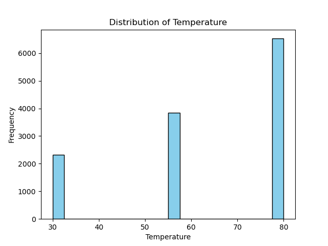
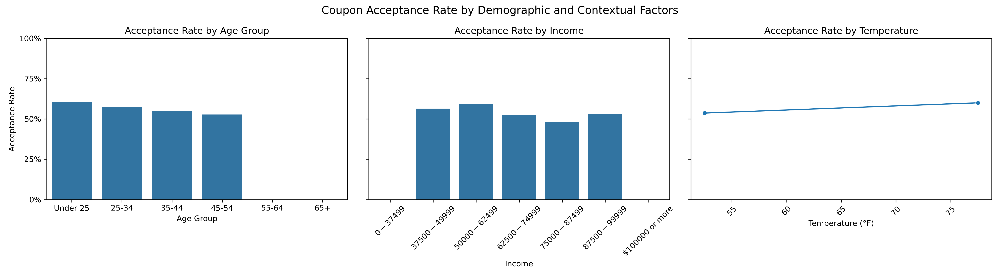
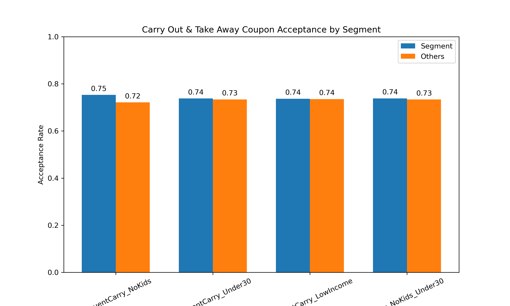

# Coupon Acceptance Analytics
**This project explores how drivers' profile characteristics, such as age, income, passenger type, and marital status, influence their responses to different coupon types. Using data analysis and visualization techniques, I aim to uncover patterns and insights that can inform targeted promotional strategies through this exercise.**

## Background
This project uses the Coupon dataset (from a survey via Amazon Mechanical Turk, available through the UCI Machine Learning Repository) with a learning-focused approach to demonstrate core data analytics skills. It provides an opportunity to explore, clean, and visualize data, examine behavioral patterns based on demographic and situational factors, calculate acceptance probabilities, segment driver groups, and derive actionable insights. The ultimate aim is to understand which drivers are most likely to accept coupons, helping marketers optimize promotional campaigns, all within a structured hands-on context.

## Objective / Goal
- Explore patterns in driver behavior and decision-making related to coupon acceptance.
- Identify key factors—such as passenger type, age, income, destination, and visit frequency—that influence whether a coupon is accepted.
- Generate visual insights and data-driven hypotheses to support targeted marketing and promotional strategies.

## Dataset Description
- **Number of Observations:** ~12,680  
- **Key Features:**
  - `coupon` – Type of coupon delivered (e.g., Bar, Coffeehouse, Restaurant).  
  - `Bar`, `CoffeeHouse`, `RestaurantLessThan20`, `Restaurant20To50` – Frequency of visits to these establishments.  
  - `passanger`, `maritalStatus`, `age`, `income`, `weather`, `time` – Demographic and situational characteristics.  
  - `Y` – Target variable: 1 if the driver accepted the coupon, 0 otherwise.  
  - Detailed description of various attributes is provided in [this jupyter notebook](https://github.com/swarnima-shrivastava/coupon-acceptance-analytics/blame/main/prompt.ipynb)

## Data Preprocessing
- **Missing Values:** Present in below features and handled during preprocessing. For example, `car` is more likely to be dropped as it is missing in 99% times whereas it was more reasonable to impute the other columns with mode (or another meaningful value).
    ```
    Missing Data Report:
                        Missing Values  Percent Missing
    car                            12576        99.148534
    Bar                              107         0.843582
    CoffeeHouse                      217         1.710817
    CarryAway                        151         1.190476
    RestaurantLessThan20             130         1.024913
    Restaurant20To50                 189         1.490066
    ```
- Converted categorical attributes like `age`, `frequency` and `income` to numeric values.  
    ```
    data['age_num'] = data['age'].replace({'50plus': 55, 'below21': 20}).astype(float)

    ```

    ```
    frequency_map = {
        'never': 0,
        '1~3': 2,
        '4~8': 6,
        'gt8': 10
    }
    bar_data['Bar_numFreq'] = bar_data['Bar'].map(frequency_map)
    ```

    ```
    income_map = {
        '$0 - $37499': 0, '$37500 - $49999': 37500, '$50000 - $62499': 50000,
        '$62500 - $74999': 62500, '$75000 - $87499': 75000, '$87500 - $99999': 87500,
        '$100000 or more': 100000
    }
    cheap_rest_data['CheapRest_incomeGrp'] = cheap_rest_data['income'].map(income_map)
    ```
- Filtered subsets for targeted analysis (e.g., bar coupons).  
    ```
    bar_data = data[data['coupon']=='Bar'].copy()
    carry_data = data[data['coupon'] == 'Carry out & Take away'].copy()
    ```

## Exploratory Data Analysis(EDA) & Key Findings

The purpose of EDA is to **understand the data, discover patterns, and identify trends** before performing any predictive analysis. This project examines **driver behavior and coupon acceptance** across different coupon types, demographics, and situational factors.

**1. Coupon Distribution**  
   - Shows the frequency of each coupon type (e.g., Bar, Coffeehouse, Cheap/Expensive Restaurants) to help understand the dataset composition and which coupon types are more common. The graph shows that `Coffee House` is the most offered coupon type and `Restaurant(20-50)` is the least commonly offered type.
   
   - Another plot shows that most of the coupons were offered during slightly warm weather conditions.
   


**2. Acceptance by Coupon Types**  
   - This graph compares how likely drivers are to accept each coupon type. In the graph, it's clear that the most accepted coupon type is `Carry out & Take away` whereas the most rejected coupon type is `Bar`.
   
   

**3. Coupon Acceptance by Age, Income, Temprature and Time**  
   - Below graphs depict the distribution of age, income and temperature that reveals trends like the most likely age group to accept coupons is under 25, income range is not that a significant factor by itself, and same can be said for weather conditions during trips as well.
    
   - Below graph depicts *Acceptance Rate by Time of the Day*  and it appears like acceptance rate tend to slightly increase around mid day.
     (Converted `time` (e.g., 7AM, 2PM) to numeric hours and calculate acceptance rates for each hour)
    

**4. Passenger Influence**  
   Passenger presence significantly influences coupon acceptance. Drivers traveling with children show lower acceptance rates, while those driving alone or with adult friends/partners are more likely to accept coupons as compared to the ones who rejected, suggesting situational constraints play a key role in the decision-making.
   

**5. Overall correlation between numeric features and coupon acceptance (Y)** can be depicted using below heatmap.

**Key Observations**
1. Drivers who accept one coupon type are more likely to accept other coupon types, which is intuitive as well when it comes to habitual lifestyle patterns. Drivers who already frequent similar venues are more likely to accept coupons.

2. Demographics are weak predictors and the acceptance decision has very less to do with temprature, income or age independently. They have a very week correlation with acceptance when looked at individually.

---


---

**Summary**
The correlation analysis confirms that coupon acceptance is driven more by behavioral patterns than by demographic attributes. While individual feature correlations with acceptance are modest, strong relationships among venue-visiting behaviors highlight the importance of segment-based analysis.

## Illustrative Investigations

### Coupon Type - *Bar*
This investigation focuses on driver behavior in response to **Bar coupons**. Using exploratory data analysis and visualizations, we aim to identify the key factors that influence coupon acceptance and generate actionable insights for predictive modeling and marketing strategies.

Below graph depicts the acceptance rate between those who went to a bar 3 or fewer times a month to those who went more and they are less likely to accept bar coupons

        
Similarly, following graph depicts the acceptance rate between drivers who go to a bar more than once a month and are over the age of 25 to the all others. They are more likely to accept the coupons than the others.

        
As another example, below graph depicts the acceptance rate between drivers who go to bars more than once a month and had passengers that was not a kid and had occupations other than farming, fishing, or forestry. The plot shows that these drivers are more likely to accept bar coupons, highlighting the influence of both passenger type and occupation.


Furthermore, this graph depict comparison of the acceptance rates between those drivers that below to one of the following categories.
1. go to bars more than once a month, had passengers that were not a kid, and were not widowed
2. go to bars more than once a month and are under the age of 30 
3. go to cheap restaurants more than 4 times a month and income is less than 50K

The data shows there is similarity in the bar coupon acceptance behavior between these categories.

**Summary**: Drivers who frequently visit bars, are not accompanied by children, and are not widowed have the highest likelihood of accepting bar coupons (~77%). Younger drivers (under 30) who frequently go to bars also show a high acceptance rate (~73%). Drivers who are occasional bar-goers, accompanied by children, or widowed are less likely to accept bar coupons (~35-37%).

**Predictive Insights / Hypotheses**
The insights above help **identify patterns and trends** in coupon acceptance and form the basis for **hypotheses** about why some drivers accept coupons while others do not. These hypotheses set the stage for further **predictive analysis**.  

1. **Behavior-driven acceptance:** Drivers whose **habits align with the coupon type** (e.g., frequent bar-goers for bar coupons or regular visitors to budget restaurants) are more likely to accept relevant coupons.  
2. **Situational influences:** Factors such as **passenger presence**, marital status, and age significantly affect acceptance. Drivers traveling alone or with adults, and younger drivers, tend to accept coupons more often.  
3. **Income-specific patterns:** Low-income drivers who frequently visit cheap restaurants show higher acceptance rates for restaurant coupons but are less likely to accept bar coupons.
4. **Combined predictive signals:** **Behavioral patterns coupled with demographic characteristics** including visit frequency, age, income, passenger type and marital status provide strong predictive indicators for coupon acceptance.  

### Coupon Type - *Carry out & Take away*
This investigation focuses on driver behavior in response to **Carry out & Take away coupons**. Using exploratory data analysis and visualizations, we aim to identify the key factors that influence coupon acceptance and generate actionable insights for predictive modeling and marketing strategies.

We analyzed the following segments based on driver behavior, age, income, and passenger presence:

| Segment | Definition | Acceptance Rate |
|---------|------------|----------------|
| FrequentCarry_NoKids | Frequent visitors (Carry_numFreq > 3) traveling without children | 75.3% |
| FrequentCarry_Under30 | Younger drivers (<30) who visit frequently (Carry_numFreq > 1) | 73.8% |
| FrequentCarry_LowIncome | Low-income drivers (<$50k) who visit frequently (Carry_numFreq > 4) | 73.7% |
| Carry_NoKids_Under30 | Drivers under 30 traveling without children | 73.8% |

**Observations:**  As seen in below graph, 
- The **highest acceptance** is seen among **frequent visitors without children**, suggesting convenience and habitual behavior drive coupon redemption.  
- **Younger drivers** and **low-income frequent visitors** also show slightly higher acceptance than the overall population.  
- Differences between segments and “Others” are **modest**, but they still indicate meaningful trends for targeting.



**Summary**: Preliminary analysis indicates that **habitual restaurant visits, passenger composition, age, and income** are strong predictors of Carry Out & Take Away coupon acceptance. Drivers who frequently order takeout, travel with children, or are younger show higher acceptance rates. These patterns align with behavioral and situational expectations for takeout services. Insights from this investigation provide a foundation for **predictive modeling** and enable **targeted marketing strategies**, such as offering promotions during peak meal times or to driver segments likely to value convenience.

**Predictive Insights / Hypotheses**
1. **Behavior-driven acceptance:** Frequent carry-out visitors are more likely to redeem coupons, especially when traveling without children.  
2. **Demographic influence:** Younger drivers and low-income drivers are slightly more responsive to Carry Out & Take Away coupons.  
3. **Combined predictive signals:** **Behavior + demographics** provide the best predictive power for targeted marketing.  

### **Marketing implications:** 
These insights enable **targeted marketing strategies**, allowing businesses to focus promotions on segments most likely to respond positively, thereby maximizing the efficiency of coupon campaigns.Promotions can be **timed around peak takeout hours** and targeted to **frequent visitors under 30 or without children** for maximum impact.

## Conclusion
This project examined driver behavior in response to various coupon types using exploratory data analysis and visualizations. Key factors influencing coupon acceptance included **habitual behavior, passenger presence, age, income, and marital status**. Drivers who frequently visit bars, travel without children, and are younger were most likely to accept coupons, whereas occasional bar-goers or those traveling with children exhibited lower acceptance rates.  

The insights from this analysis provide a foundation for **predictive modeling** and enable marketers to design **targeted promotional campaigns** by focusing on driver segments most likely to respond. Overall, the project demonstrates how **data-driven exploration can uncover meaningful patterns in consumer behavior** and guide effective marketing strategies.

## Future Work

- Develop a **predictive model** for coupon acceptance using approaches such as logistic regression, decision trees, or random forests.  
- Evaluate model performance and analyze **feature importance** to extract actionable insights for targeted marketing strategies.


## Technologies Used
- Python (pandas, NumPy)  
- Data visualization: matplotlib, seaborn  
- Jupyter Notebook for analysis and exploration  

## References / Dataset Source
- UCI Machine Learning Repository – [Coupon Dataset](https://archive.ics.uci.edu/ml/datasets/Coupon+Recommendation)  
